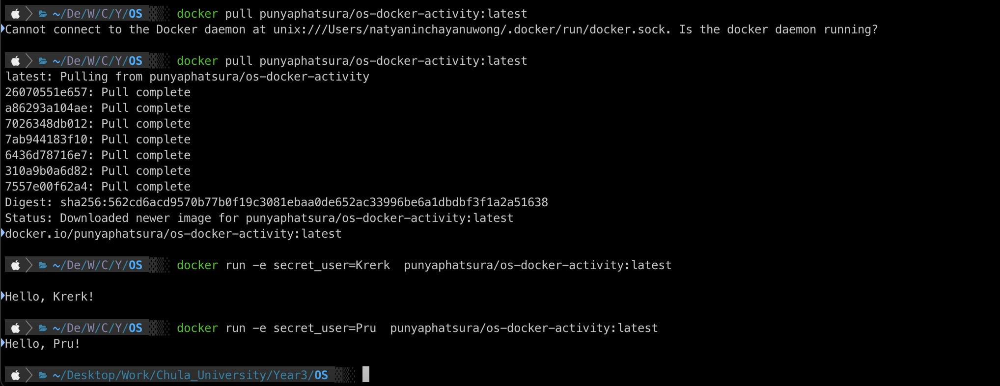

## OS Activity Container

### 1. Python File

### 2. Docker File

### 3. Build Image

### 4. Test build

### 5. Push Docker Image to Docker Hub

### 6. Test Pull and Run in other team member device

