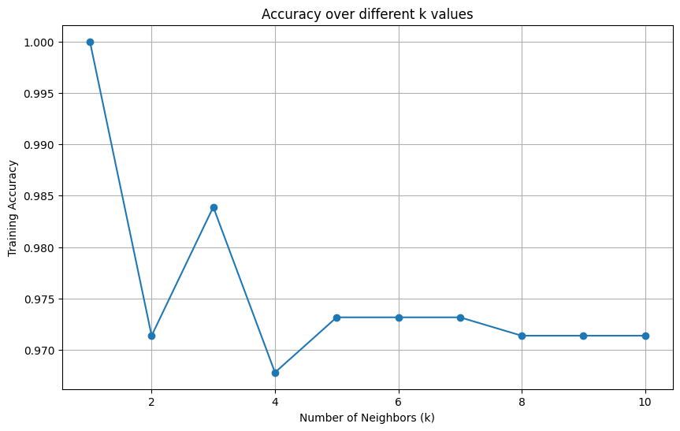
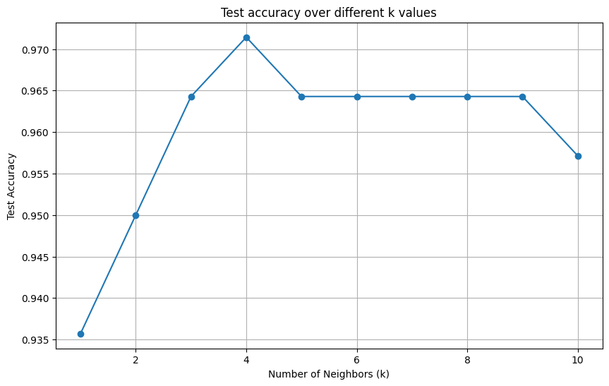

# Assignment1 K-Nearest Neighbors

**Punyaphat Surakiatkamjorn 6432106821**

**Colab** [**Link**](https://colab.research.google.com/drive/1_j2RK4wIOvHPMdER8AkWyuNHeRwSHaPO?usp=sharing)

## Preprocessing data

### Data Information

```
RangeIndex: 699 entries, 0 to 698
Data columns (total 11 columns):

 #   Column             Non-Null Count  Dtype
---  ------             --------------  -----
 0   id                 699 non-null    int64
 1   clump_thickness    699 non-null    int64
 2   size_uniformity    699 non-null    int64
 3   shape_uniformity   699 non-null    int64
 4   marginal_adhesion  699 non-null    int64
 5   epithelial_size    699 non-null    int64
 6   bare_nucleoli      699 non-null    object
 7   bland_chromatin    699 non-null    int64
 8   normal_nucleoli    699 non-null    int64
 9   mitoses            699 non-null    int64
 10  class              699 non-null    int64
dtypes: int64(10), object(1)
memory usage: 60.2+ KB
```

The `bare_nucleoli` column, initially of type `object`, was converted to numeric to address the discrepancy.

```python
data['bare_nucleoli'] = pd.to_numeric(data['bare_nucleoli'], errors='coerce')
```

### **Data Preprocessing Steps**

#### **Convert the classes to 0 (benign) and 1 (malignant) for using in the classifier**

The class column originally contains values 2 (benign) and 4 (malignant). These were converted to 0 and 1 respectively for compatibility with the classifier.

```python
data['class'] = data['class'].map({2: 0, 4: 1})
```

#### **Fill in Missing values, if exist (try using Mode value)**

```python
data.fillna(data.mode().iloc[0],inplace=True)
```

#### **Drop non-value added features**

The id column was dropped because it does not provide meaningful information for classification.

```python
data = data.drop(['id'], axis=1)
```

#### **Standardization (Only feature)**

Only the features were standardized. The target variable (class) was not standardized as it represents categorical data.

```python
X = data.drop(columns=['class'])
y = data['class']

std = StandardScaler()
X_scaled = std.fit_transform(X)
```

## Train-Test Split

The dataset was split into training and testing sets, with 80% of the data used for training and 20% for testing. A `random_state` of 1234 was set to ensure reproducibility.

```py
X_train, X_test, y_train, y_test = train_test_split(X_scaled, y, test_size=0.2, random_state=1234)
```

<div style="page-break-after: always; visibility: hidden">
\pagebreak
</div>

## Tuning K

Looping k=1 to k=10 and plot the graph for finding the appropiate k

```py
k_values = range(1, 11)
accuracies = []

for k in k_values:
    knn = KNeighborsClassifier(n_neighbors=k, metric='minkowski', p=2)
    knn.fit(X_train, y_train)
    y_pred_train = knn.predict(X_train)
    accuracy = knn.score(X_train, y_train)
    accuracies.append(accuracy)
```

```python
plt.figure(figsize=(10, 6))
plt.plot(k_values, accuracies, marker='o', linestyle='-')
plt.title('Accuracy over different k values')
plt.xlabel('Number of Neighbors (k)')
plt.ylabel('Training Accuracy')
plt.grid()
plt.show()
```



<div style="page-break-after: always; visibility: hidden">
\pagebreak
</div>

## Selecting K

The results indicated that the highest training accuracy was achieved with k = 1. However, this choice raises several concerns:

- Overfitting Risk: A k value of 1 can perfectly fit the training data but may not generalize well to new, unseen data, risking overfitting.
  Sensitivity to Noise: With k = 1, a single noisy data point can disproportionately affect predictions.
- As k increases, the model's generalization improves, but it may underfit the data if k becomes too large. Thus, the appropriate k value should balance bias and variance to ensure good generalization on unseen data. Typically, an odd value of k is preferred to avoid ties.

Given these considerations, I selected k = 3 because it is the second highest peak in accuracy. This value provides a better balance between performance and generalization, minimizing the risks associated with overfitting.

## Train the Model by Selected K

```py
selected_k = 3

final_model = KNeighborsClassifier(n_neighbors=selected_k, metric='minkowski', p=2)
final_model.fit(X_train, y_train)
test_accuracy = final_model.score(X_test, y_test)
print(f"\nFinal test set accuracy with k={selected_k}: {test_accuracy:.4f}")

y_pred = final_model.predict(X_test)
print("\nConfusion Matrix:")
print(confusion_matrix(y_test, y_pred))
print("\nClassification Report:")
print(classification_report(y_test, y_pred))
```

<div style="page-break-after: always; visibility: hidden">
\pagebreak
</div>

### Result

- Final Test Set Accuracy: The model achieved an accuracy of 0.9643 on the test set with K = 3. This indicates that approximately 96.43% of the predictions made by the model were correct.

```
Final test set accuracy with k = 3: 0.9643

Confusion Matrix:
[[97  3]
 [ 2 38]]

Classification Report:
              precision    recall  f1-score   support

           0       0.98      0.97      0.97       100
           1       0.93      0.95      0.94        40

    accuracy                           0.96       140
   macro avg       0.95      0.96      0.96       140
weighted avg       0.96      0.96      0.96       140
```

<div style="page-break-after: always; visibility: hidden">
\pagebreak
</div>

## Extra: Finding the Best k for Test Data

To further refine the model's performance, we evaluated the accuracy of the k-NN classifier across various k values specifically on the test dataset. This helps identify the optimal k that maximizes test accuracy.

```py
test_accuracies = []
for k in k_values:
    final_model = KNeighborsClassifier(n_neighbors=k, metric='minkowski', p=2)
    final_model.fit(X_train, y_train)
    test_accuracy = final_model.score(X_test, y_test)
    test_accuracies.append(test_accuracy)

print('Highest accuracy:', max(test_accuracies), ', with K =', test_accuracies.index(max(test_accuracies)) + 1)
plt.figure(figsize=(10, 6))
plt.plot(k_values, test_accuracies, marker='o', linestyle='-')
plt.title('Test accuracy over different k values')
plt.xlabel('Number of Neighbors (k)')
plt.ylabel('Test Accuracy')
plt.grid()
plt.show()
```

<div style="page-break-after: always; visibility: hidden">
\pagebreak
</div>

### Results

The evaluation of various k values revealed that the model achieved its highest accuracy at k=4, with a remarkable accuracy of 97.14%. This indicates that the k-NN classifier performed exceptionally well in distinguishing between benign and malignant cases.

```
Highest accuracy: 0.9714285714285714 , with K = 4
```



While the accuracy at k=3 was also strong at 96.43%, the difference of approximately 0.71% between k=3 and k=4 suggests that the choice of k has a relatively modest impact on performance in this instance. This slight improvement highlights the importance of carefully tuning k to optimize model performance while balancing the risks of overfitting and underfitting.

In summary, although both k=3 and k=4 yielded high accuracies, selecting k=4 maximizes the model’s predictive capability, ensuring robust performance on unseen data.
