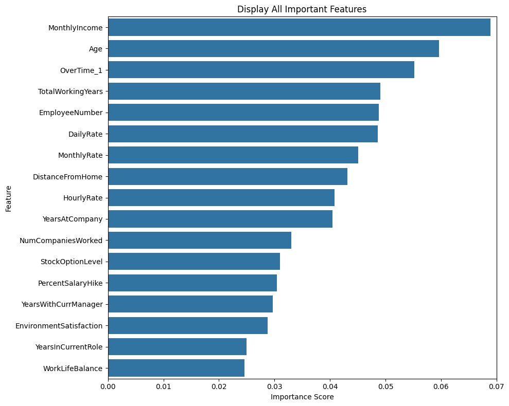
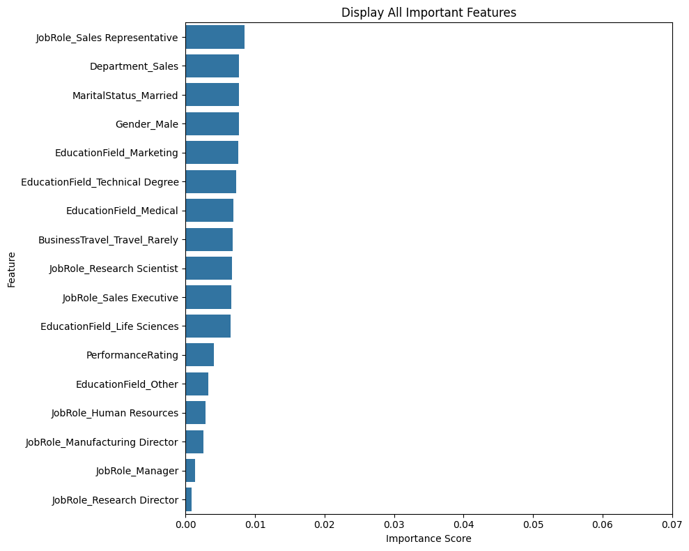

# Assignment 2 Decision Tree Classifiers

**Punyaphat Surakiatkamjorn 6432106821**

**Colab** [**Link**](https://colab.research.google.com/drive/1kVub-8OF3aH8zeXXd_MRV8EOyBFyClVu?usp=sharing)

## **Preprocessing data**

### **Data Information**

```
RangeIndex: 1470 entries, 0 to 1469
Data columns (total 35 columns):
 #   Column                    Non-Null Count  Dtype
---  ------                    --------------  -----
 0   Attrition                 1470 non-null   object
 1   Age                       1470 non-null   int64
 2   BusinessTravel            1470 non-null   object
 3   DailyRate                 1470 non-null   int64
 4   Department                1470 non-null   object
 5   DistanceFromHome          1470 non-null   int64
 6   Education                 1470 non-null   int64
 7   EducationField            1470 non-null   object
 8   EmployeeCount             1470 non-null   int64
 9   EmployeeNumber            1470 non-null   int64
 10  EnvironmentSatisfaction   1470 non-null   int64
 11  Gender                    1470 non-null   object
 12  HourlyRate                1470 non-null   int64
 13  JobInvolvement            1470 non-null   int64
 14  JobLevel                  1470 non-null   int64
 15  JobRole                   1470 non-null   object
 16  JobSatisfaction           1470 non-null   int64
 17  MaritalStatus             1470 non-null   object
 18  MonthlyIncome             1470 non-null   int64
 19  MonthlyRate               1470 non-null   int64
...
 33  YearsSinceLastPromotion   1470 non-null   int64
 34  YearsWithCurrManager      1470 non-null   int64
dtypes: int64(26), object(9)
memory usage: 402.1+ KB
```

<div style="page-break-after: always; visibility: hidden">
\pagebreak
</div>

### **Data Preprocessing Steps**

#### **Find and remove variables that do not change across the observation**

```python
drop_columns = []
for k in df.keys():
    if len(df[k].unique()) == 1:
        drop_columns.append(k)
print('droped columns:',drop_columns)
df.drop(drop_columns, axis=1, inplace=True)
```

```
droped columns: ['EmployeeCount', 'Over18', 'StandardHours']
```

#### **Identified categorical columns and numerical columns**

```python
categorical_columns = df.select_dtypes(include=['object']).columns
numeric_columns = df.select_dtypes(include=['int64', 'float64']).columns

delete_index = categorical_columns.get_loc('Attrition')
categorical_columns = categorical_columns.delete(delete_index)

print('Categorical columns:',categorical_columns)
print('Numeric columns:',numeric_columns)
```

```
Categorical columns: Index(['BusinessTravel', 'Department', 'EducationField', 'Gender', 'JobRole',
       'MaritalStatus', 'OverTime'],
      dtype='object')
Numeric columns: Index(['Age', 'DailyRate', 'DistanceFromHome', 'Education', 'EmployeeNumber',
       'EnvironmentSatisfaction', 'HourlyRate', 'JobInvolvement', 'JobLevel',
       'JobSatisfaction', 'MonthlyIncome', 'MonthlyRate', 'NumCompaniesWorked',
       'PercentSalaryHike', 'PerformanceRating', 'RelationshipSatisfaction',
       'StockOptionLevel', 'TotalWorkingYears', 'TrainingTimesLastYear',
       'WorkLifeBalance', 'YearsAtCompany', 'YearsInCurrentRole',
       'YearsSinceLastPromotion', 'YearsWithCurrManager'],
      dtype='object')
```

<div style="page-break-after: always; visibility: hidden">
\pagebreak
</div>

#### **Standardize numerical fields**

```python
from sklearn.preprocessing import StandardScaler

scaler = StandardScaler()
for k in numeric_columns:
    df[k] = scaler.fit_transform(df[[k]])
```

#### **Convert categorical to numerical**

```python
for col in categorical_columns:
    dummy = pd.get_dummies(df[col], prefix=col, dtype=int, drop_first=True)
    df = pd.concat([df, dummy], axis=1)
    df.drop(col, axis=1, inplace=True)
```

#### **Split feature and class**

```py
X = df.drop('Attrition', axis=1)
y = df['Attrition']
```

<div style="page-break-after: always; visibility: hidden">
\pagebreak
</div>

## **Configuration model**

### **Dicision Tree**

```py
from sklearn.tree import DecisionTreeClassifier

decision_tree = DecisionTreeClassifier()

decision_tree.fit(X, y)

y_tree_pred = decision_tree.predict(X)

tree_depth = decision_tree.get_depth()
print('Tree Depth:', tree_depth)

tree_conf_matrix = confusion_matrix(y, y_tree_pred)
print('Confusion Matrix:\n', tree_conf_matrix)

tree_scores = cross_val_score(decision_tree, X, y, cv=5)

print('Cross-validation scores:', tree_scores)
print('Mean cross-validation score:', tree_scores.mean())
```

```
Tree Depth: 19
Confusion Matrix:
 [[1233    0]
 [   0  237]]
Cross-validation scores: [0.81292517 0.75510204 0.77891156 0.78571429 0.78231293]
Mean cross-validation score: 0.7829931972789115
```

<div style="page-break-after: always; visibility: hidden">
\pagebreak
</div>

### **Dicision Tree with Grid serach CV**

```py
from sklearn.model_selection import GridSearchCV

param_grid = {
        'max_depth': [1, 2, 3,4, 5, 10, 15, 20],
        'min_samples_split': [2, 5, 10],
        'min_samples_leaf': [1, 2, 4],
        }
grid_search_cv = GridSearchCV(decision_tree, param_grid=param_grid, cv=5)
grid_search_cv.fit(X, y)

y_grid_pred = grid_search_cv.predict(X)

grid_conf_matrix = confusion_matrix(y, y_grid_pred)
print('Confusion Matrix:\n', grid_conf_matrix)
print('Best parameters:', grid_search_cv.best_params_)

grid_scores = cross_val_score(grid_search_cv, X, y, cv=5)

print('Cross-validation scores:', grid_scores)
print('Mean cross-validation score:', grid_scores.mean())
```

```
Confusion Matrix:
 [[1212   21]
 [ 189   48]]
Best parameters: {'max_depth': 2, 'min_samples_leaf': 1, 'min_samples_split': 2}
Cross-validation scores: [0.84013605 0.85714286 0.84693878 0.84353741 0.84013605]
Mean cross-validation score: 0.8455782312925171
```

<div style="page-break-after: always; visibility: hidden">
\pagebreak
</div>

### **Random Forest with Grid seach CV**

```py
from sklearn.ensemble import RandomForestClassifier

param_grid = {
        'n_estimators': [100, 150, 200],
        'max_depth': [5, 10, 15, 20],
        'min_samples_split': [2, 5, 10, 15, 20],
        'max_features': ['sqrt', 'log2']
    }
forest = RandomForestClassifier(random_state=42)
grid_forest = GridSearchCV(forest, param_grid, cv=5, scoring='accuracy')
grid_forest.fit(X, y)

y_grid_forest_pred = grid_forest.predict(X)
print('Best parameters:', grid_forest.best_params_)
best_model = grid_forest.best_estimator_

grid_forest_scores = cross_val_score(grid_forest, X, y, cv=5)
print('Cross-validation scores:', grid_forest_scores)
print('Mean cross-validation score:', grid_forest_scores.mean())
print('Confusion matrix:\n', confusion_matrix(y, y_grid_forest_pred))
```

```
Best parameters: {'max_depth': 10, 'max_features': 'sqrt', 'min_samples_split': 2, 'n_estimators': 150}
Cross-validation scores: [0.8537415  0.85034014 0.86054422 0.84693878 0.8537415 ]
Mean cross-validation score: 0.8530612244897959
Confusion matrix:
 [[1233    0]
 [  38  199]]
```

## **Results analyze**

### **Score**

| Model                          | Avg Score          |
| ------------------------------ | ------------------ |
| Decision Tree                  | 0.7795918367346938 |
| Decision Tree with Grid search | 0.8455782312925171 |
| Random forest with Grid search | 0.8530612244897959 |

From the results, the average score of the Decision Tree is quite good, but it is still low compared to the Decision Tree with Grid Search. This shows that tuning parameters significantly impacts the model's accuracy and generalization. Furthermore, the Random Forest with Grid Search achieved the highest score because it reduces variance, leading to a more reliable and accurate classifier and more accurate.

### **Feature important**

```py
feature_importance = pd.DataFrame({
        'feature': X.columns,
        'importance': best_model.feature_importances_
    }).sort_values('importance', ascending=False)

plt.figure(figsize=(10, 16))
sns.barplot(
    x='importance',
    y='feature',
    data=feature_importance
)
plt.title(f'Display All Important Features')
plt.xlabel('Importance Score')
plt.ylabel('Feature')
plt.tight_layout()
plt.show()
```

<div align="center">
    
    
</div>

The most important features is `MonthlyIncome`. This show how financial compensation impacts an employee's decision to stay or leave a company.
