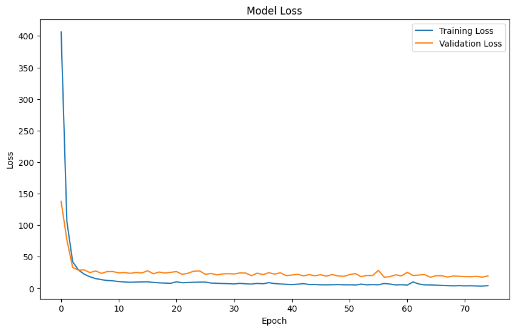

# Assignment 3 - Artificial Neural Network

**Punyaphat Surakiatkamjorn 6432106821**

**Colab** [**Link**](https://colab.research.google.com/drive/1IFDdNRQ0XqP-4YLD0fSHi4LxkrK8xACv?usp=sharing)

## **1. Data Preparation**

- **Data Loading**: Read the housing price dataset from `housePrice_data.csv`.
- **Feature Extraction**: Extracted 13 features (`crim`, `zn`, ..., `lstat`) and 1 target variable (`medv`).
- **Data Cleaning**: Converted raw text to numeric values and ensured no missing values.
- **Data Splitting**: Divided data into:
  - Training set (80%)
  - Testing set (20%)
- **Data Scaling**: Standardized features using `StandardScaler` to improve neural network training.

```python
# Load and prepare the data
header = ['crim', 'zn', 'indus', 'riverside', 'nox', 'rm', 'age', 'dis', 'rad', 'tax', 'ptratio', 'black', 'lstat', 'medv']
feature = header[:-1]
target = header[-1]

houseData = pd.read_csv('./housePrice_data.csv', names=['header'])
df = pd.DataFrame(columns=header)
for i in range(len(houseData)):
    df = pd.concat([df, pd.DataFrame([[float(i) for i in houseData.iloc[i].values[0].split()]], columns=header)], ignore_index=True)

# Split data into features and target
X = df[feature]
y = df[target]

X_train, X_test, y_train, y_test = train_test_split(X, y, test_size=0.2, random_state=1234)

# Scale the features
scaler = StandardScaler()
X_train_scaled = scaler.fit_transform(X_train)
X_test_scaled = scaler.transform(X_test)
```

<div style="page-break-before:always"></div>

## **2. Model Design**

- **Architecture**:
  - Input Layer: Accepts 13 features.
  - Hidden Layer: 1 dense layer with tunable units (32-512) and ReLU activation.
  - Output Layer: Single dense layer for regression.
- **Optimization**:
  - Loss Function: Mean Squared Error (MSE)
  - Metric: Mean Absolute Error (MAE)
  - Optimizer: Adam with a tunable learning rate (1e-4 to 1e-2).

```python
# Define the model-building function
def build_model(hp):
    model = keras.Sequential([
        # Input layer
        keras.layers.Input(shape=(X_train.shape[1],)),

        # Hidden layer with tunable units and ReLU activation
        keras.layers.Dense(
            units=hp.Int('units', min_value=32, max_value=512, step=32),
            activation='relu'
        ),

        # Output layer
        keras.layers.Dense(1)
    ])

    # Compile with tunable learning rate
    learning_rate = hp.Float(
        'learning_rate',
        min_value=1e-4,
        max_value=1e-2,
        sampling='log'
    )

    optimizer = keras.optimizers.Adam(learning_rate=learning_rate)

    model.compile(
        optimizer=optimizer,
        loss='mean_squared_error',
        metrics=['mae']
    )

    return model
```

<div style="page-break-before:always"></div>

## **3. Hyperparameter Tuning**

- **Search Algorithm**: Used `Hyperband` from `keras_tuner` for hyperparameter optimization.
- **Tunable Parameters**:
  - Hidden Layer Units: 32 to 512 (step 32)
  - Learning Rate: 1e-4 to 1e-2 (log scale)
- **Stopping Criterion**:
  - Early stopping based on validation loss with patience of 10 epochs.

```python
tuner = kt.Hyperband(
    build_model,
    objective='val_mae',
    max_epochs=100,
    factor=3,
    directory='hyperparameter_tuning',
    project_name='house_price_prediction'
)
stop_early = keras.callbacks.EarlyStopping(monitor='val_loss', patience=10)

tuner.search(
    X_train_scaled, y_train,
    validation_split=0.2,
    epochs=100,
    callbacks=[stop_early]
)
```

---

## **4. Training**

- **Best Hyperparameters Identified**:
  - Hidden Layer Units: 384
  - Learning Rate: 0.0095
- **Model Training**:
  - Validation split: 20% of training data.
  - Epochs: Up to 100 with early stopping.

```python
# Train the best model
best_hps = tuner.get_best_hyperparameters(num_trials=1)[0]
best_model = tuner.hypermodel.build(best_hps)

history = best_model.fit(
    X_train_scaled, y_train,
    validation_split=0.2,
    epochs=100,
    callbacks=[stop_early]
)
```

### **Plot training and validation loss**

```python
# Plot training & validation loss
plt.figure(figsize=(10,6))
plt.plot(history.history['loss'], label='Training Loss')
plt.plot(history.history['val_loss'], label='Validation Loss')
plt.title('Model Loss')
plt.ylabel('Loss')
plt.xlabel('Epoch')
plt.legend()
plt.show()
```



<div style="page-break-before:always"></div>

## **5. Model Evaluation**

```python
# Evaluate the model
y_pred = best_model.predict(X_test_scaled).flatten()
mae = mean_absolute_error(y_test, y_pred)
mse = mean_squared_error(y_test, y_pred)
rmse = np.sqrt(mse)

print("Best Hyperparameters:")
print(f"Hidden Layer Units: {best_hps.get('units')}")
print(f"Learning Rate: {best_hps.get('learning_rate')}")
print("\nModel Performance:")
print(f"Mean Absolute Error (MAE): {mae}")
print(f"Mean Squared Error (MSE): {mse}")
print(f"Root Mean Squared Error (RMSE): {rmse}")
```

```
Best Hyperparameters:
Hidden Layer Units: 384
Learning Rate: 0.009534114815412765
Optimized Epochs: 75

Model Performance:
Mean Absolute Error (MAE): 2.2181286961424584
Mean Squared Error (MSE): 7.794060560749432
Root Mean Squared Error (RMSE): 2.7917844760563866
```

---

## **6. Results and Analysis**

### **Evaluation Metrics**

| Metric                             | Value |
| ---------------------------------- | ----- |
| **Mean Absolute Error (MAE)**      | 2.21  |
| **Mean Squared Error (MSE)**       | 7.79  |
| **Root Mean Squared Error (RMSE)** | 2.79  |

- The **Mean Absolute Error (MAE)** of 2.21 indicates that, on average, the model's predictions deviate from the actual housing prices by approximately 2.21 units. This is a strong performance given the scale of the target variable.
- The **Mean Squared Error (MSE)** of 7.79 further penalizes larger deviations. The relatively low value here suggests the model avoids significant outliers in its predictions.
- The **Root Mean Squared Error (RMSE)** of 2.79 represents the standard deviation of residuals (prediction errors). This metric aligns with the MAE, confirming consistent performance.
