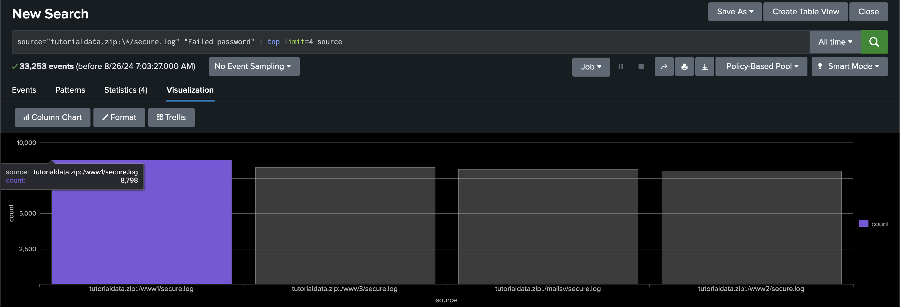

# **Activity 2**

### Q1. How many hackers are trying to get access to our servers? And how many attempts are there? Explain/define how you count distinct hackers.

**<u>Ans</u>**

How many hackers are trying to get access to our servers? -> 185

How many attempts are there? -> 33,253

หาคำตอบได้จาก query ซึ่งจํานวน events ทั้งหมดคือจํานวนครั้ง

\pagebreak

### Q2. What time do hackers appear to try to hack our servers?

**<u>Ans</u>** 18:30:08 - 18:30:11

### Q3. Which server (mailsv, www1, www2, www3) had the most attempts?

**<u>Ans</u>** www1 วิธีการหาคำตอบมาจากการใช้ Query ด้านล่าง ซึ่งจะแสดงให้เห็นว่าการโจมตีส่วนใหญ่พุ่งเป้าไปที่ www1 โดยในกรณีนี้ เราถือว่าจำนวนผู้ใช้งานที่ไม่ใช่ Hacker มีจำนวนครั้งในการใช้งานน้อยมาก จนสามารถละเว้นไปได้

\pagebreak

### Q4. What is the most popular account that hackers use to try to break in?

**<u>Ans</u>** root โดยรองลงมาคือ administrator, admin, operator ตามลำดับ

### Q5. Can you find attempts to get access to sensitive information from our web servers? How many attempts were there?

**<u>Ans</u>**

1. ทำการ query และ count จำนวน status ทั้งหมด
   

\pagebreak

2. ทำการหาผลรวมของ status 401, 403, 400, 500 _(เนื่องจาก user ทั่วไปมีโอกาสได้รับ status code นี้น้อยมาก จึง assume ว่าเป็น status code ของ hacker ทั้งหมด)_
   
   **1662**

### Q6. What resource/file are hackers looking for?

**<u>Ans</u>** ทำการ query จาก url path โดยสนใจแค่ status code ที่น่าสงสัยเท่านั้น ซึ่งได้ผลลัพธ์ดังนี้

\pagebreak

### Q7. Can you find any bots crawling our websites?

**<u>Ans</u>**

1. ทำการ search คำว่า bot เพื่อดูตัวอย่างของ log ที่มี bot
2. ทำการ filter โดย extract field และ count field
   

จะเห็นได้ว่ามี 2 bot คือ **Googlebot/2.1** และ **YandexBot/3.0**

### Q8. What are they doing on the site? (Hint: Look for User-Agent in the web access.logs.)

**<u>Ans</u>**
Googlebot/2.1 และ YandexBot/3.0 เป็นบอทจากเครื่องมือค้นหาที่ทำหน้าที่เก็บข้อมูลเว็บไซต์เพื่อปรับปรุงผลการค้นหา การเข้าถึงของพวกเขาจะถูกบันทึกในล็อกการเข้าถึง ภายใต้ฟิลด์ User-Agent โดยพวกเขาจะรวบรวมข้อมูลหน้าเว็บเพื่อใช้ในการจัดอันดับในผลการค้นหา
