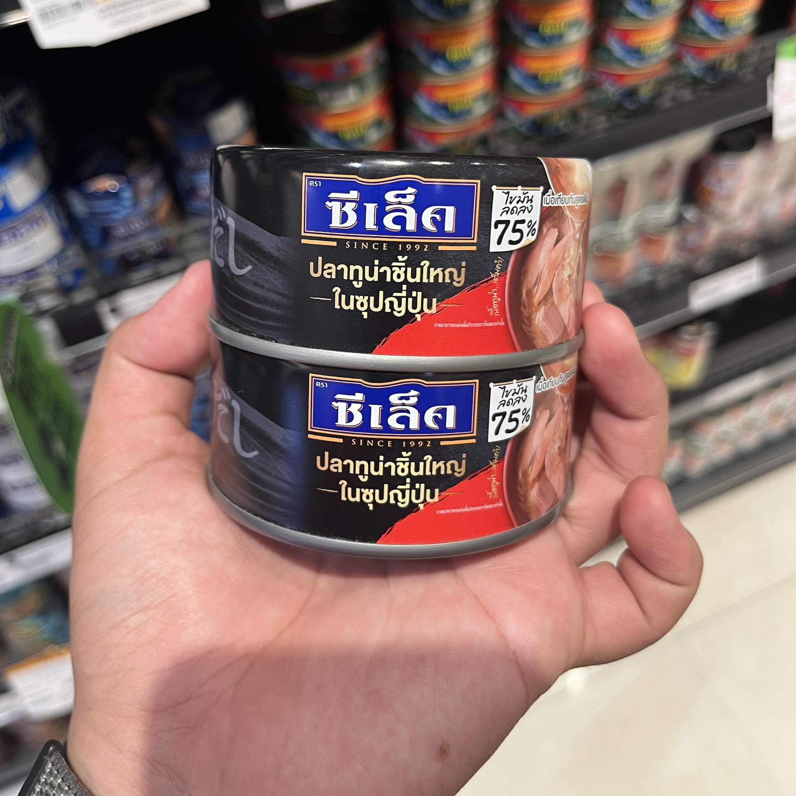
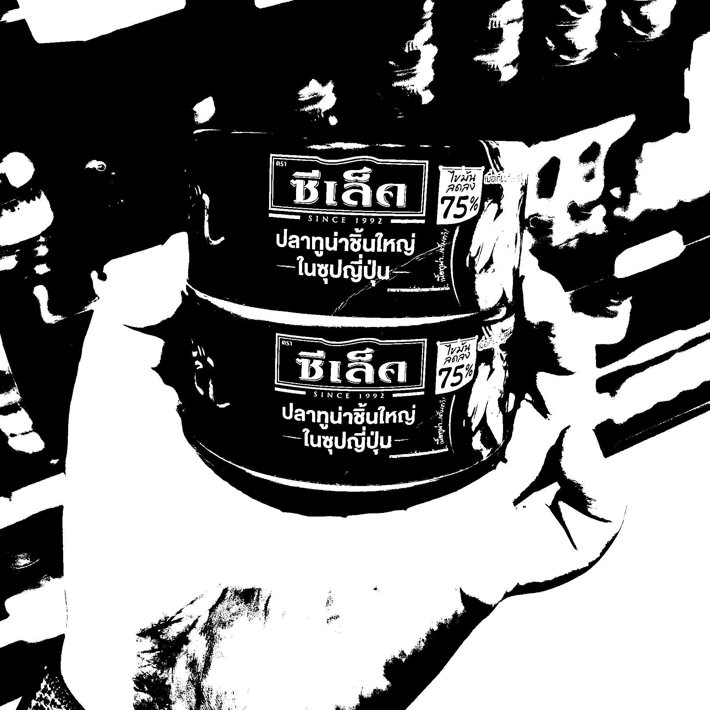
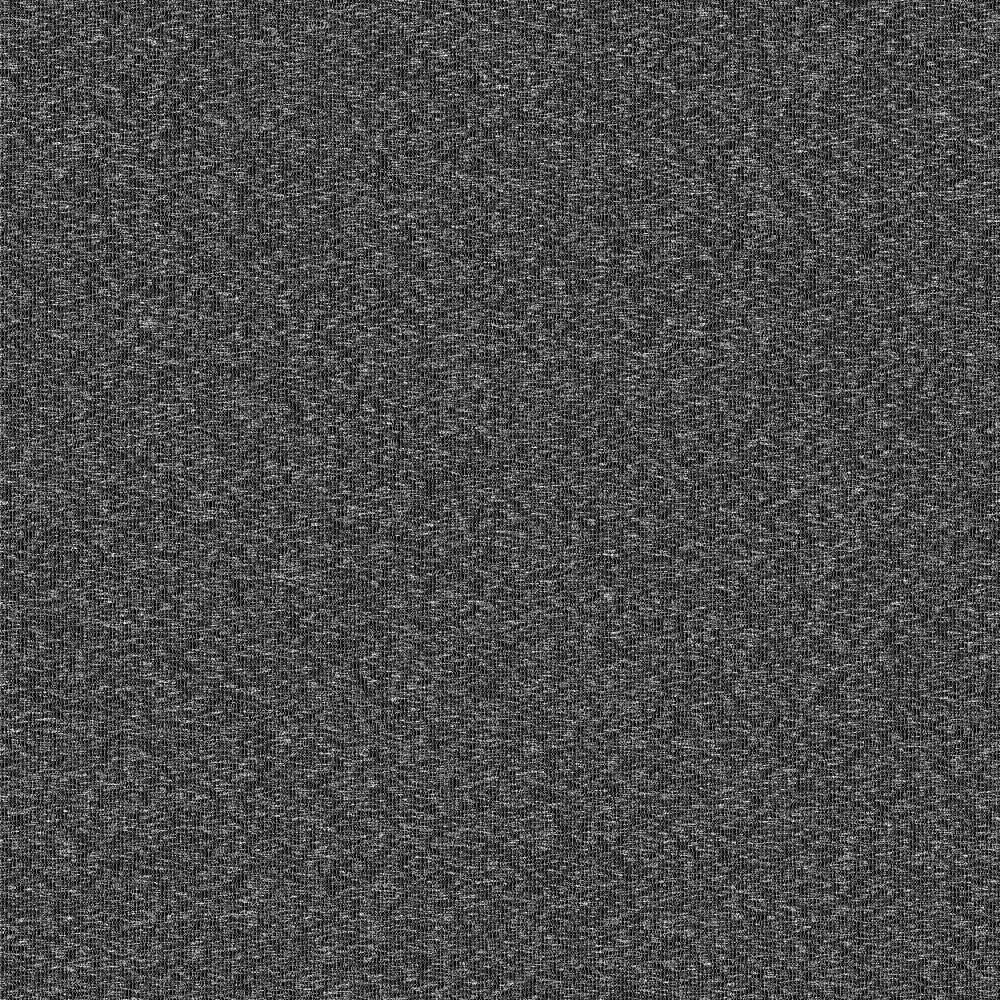
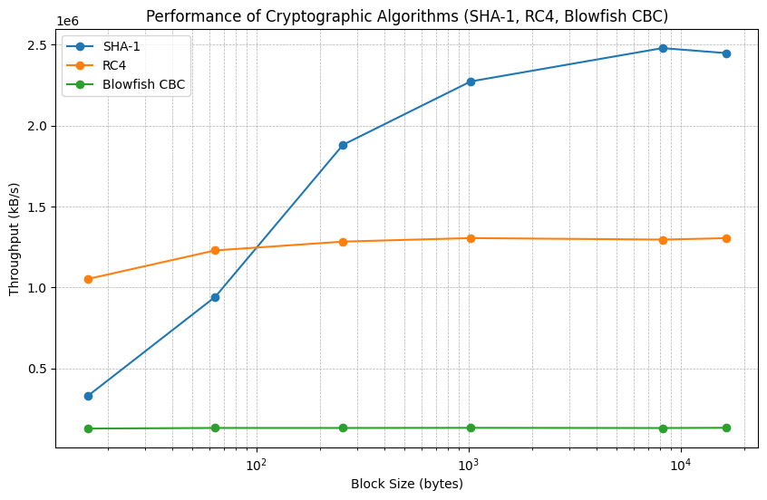
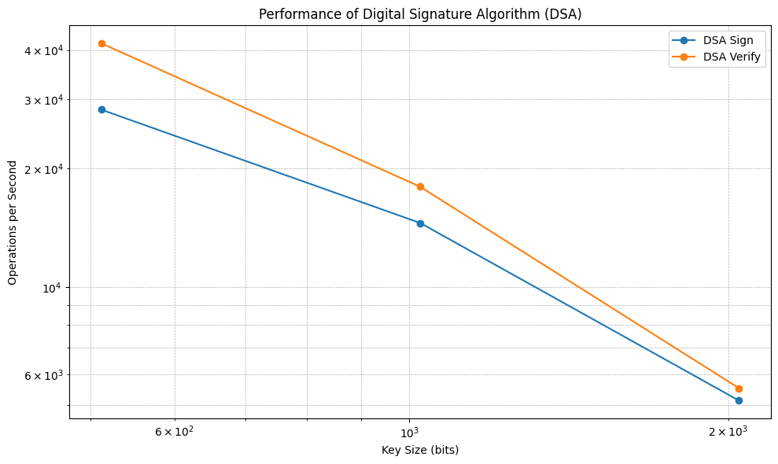

# Activity 4

## 1. (Encryption and Statistical Analysis) Though encryption is primarily designed to preserve confidentiality and integrity of data, the mechanism itself is vulnerable to brute force (statistical analysis). In other words, the more we see the encrypted data, the easier we can hack it. In this exercise, you are asked to crack the following cipher text. Please provide the decrypted result and explain your strategy in decrypting this text.

**CIPHER TEXT**

    PRCSOFQX FP QDR AFOPQ CZSPR LA JFPALOQSKR. QDFP FP ZK LIU BROJZK MOLTROE.

### a. Count the frequency of letters. List the top three most frequent characters.

**<u>Ans</u>**

| P   | F   | O   | R   | Q   | L   | K   | Z   | A   | S   | J   | D   | C   | E   | T   | M   | B   | U   | I   | X   |
| --- | --- | --- | --- | --- | --- | --- | --- | --- | --- | --- | --- | --- | --- | --- | --- | --- | --- | --- | --- |
| 7   | 6   | 6   | 6   | 5   | 4   | 3   | 3   | 3   | 3   | 2   | 2   | 2   | 1   | 1   | 1   | 1   | 1   | 1   | 1   |

Top three most frequent characters: **1st: P(7), 2nd: R(6), O(6), F(6) 3rd: Q(5)**

### b. Knowing that this is English, what are commonly used three-letter words and two-letter words. Does the knowledge give you a hint on cracking the given text?

**<u>Ans</u>**
Commonly used three-letter words in English include "THE," "AND," "FOR," and "BUT." Common two-letter words include "OF," "IS," "IN," and "TO." Recognizing these patterns can give hints for substitution in the cipher text, helping to identify likely matches and guide the decryption process.

### c. Cracking the given text. Measure the time that you have taken to crack this message.

**<u>Ans</u>**

|                      | P   | F   | O   | R   | Q   | L   | K   | Z   | A   | S   | J   | D   | C   | E   | T   | M   | B   | U   | I   | X   |
| -------------------- | --- | --- | --- | --- | --- | --- | --- | --- | --- | --- | --- | --- | --- | --- | --- | --- | --- | --- | --- | --- |
| **Frequency Count**  | 7   | 6   | 6   | 6   | 5   | 4   | 3   | 3   | 3   | 3   | 2   | 2   | 2   | 1   | 1   | 1   | 1   | 1   | 1   | 1   |
| **Substituted Char** | _S_ | _I_ | _R_ | _E_ | _T_ | _O_ | _N_ | _A_ | _F_ | _U_ | _M_ | _H_ | _C_ | _B_ | _V_ | _P_ | _G_ | _D_ | _L_ | _Y_ |

| PRCSOFQX | FP  | QDR | AFOPQ | CZSPR | LA  | JFPALOQSKR. | QDFP | FP  | ZK  | LIU | BROJZK | MOLTROE |
| -------- | --- | --- | ----- | ----- | --- | ----------- | ---- | --- | --- | --- | ------ | ------- |
| SECURITY | IS  | THE | FIRST | CAUSE | OF  | MISFORTUNE. | THIS | IS  | AN  | OLD | GERMAN | PROVERB |

### d. Explain your process in hacking such messages.

**<u>Ans</u>**

1. I first guessed that the common two-letter word "FP" might correspond to "IS".
2. I then tried fitting the word "SECURITY" into the first word of the cipher text.
3. Next, I filled in the nearly complete words to identify more of the message.
4. After decoding the phrase "SECURITY IS THE FIRST CAUSE OF MISFORTUNE. THIS IS AN O\_\_ GERMAN \_RO_ER," I searched for the sentence on Google and found that it is a German proverb.
5. After filling in "PROVERB," I was left with the word "O\_\_." I then guessed the remaining letters and completed the decryption with the word "OLD."
6. So the subtitued text is "SECURITY IS THE FIRST CAUSE OF MISFORTUNE. THIS IS AN OLD GERMAN PROVERB"

<div style="page-break-after: always; visibility: hidden">
\pagebreak
</div>

### e. If you know that the encryption scheme is based on Caesar(Monoalphabetic Substitution) that is commonly used by Caesar for sending messages to Cicero, does it allow you to crack it faster?

**<u>Ans</u>**

Yes, if you know that the encryption scheme is based on Caesar, you can substitute multiple characters (which are the same character) at the same time, allowing you to decrypt the message faster.

### f. Draw a cipher disc of the given text.

**<u>Ans</u>**

|        | A   | B   | C   | D   | E   | F   | G   | H   | I   | J   | K   | L   | M   | N   | O   | P   | Q   | R   | S   | T   | U   | V   | W   | X   | Y   | Z   |
| ------ | --- | --- | --- | --- | --- | --- | --- | --- | --- | --- | --- | --- | --- | --- | --- | --- | --- | --- | --- | --- | --- | --- | --- | --- | --- | --- |
| Ceasar | Z   | E   | C   | U   | R   | A   | B   | D   | F   | G   | H   | I   | J   | K   | L   | M   | N   | O   | P   | Q   | S   | T   | V   | W   | X   | Y   |

### g. Create a simple python program for cracking the Caesar cipher text using brute force attack. Explain the design and demonstrate your software. (You may use an English dictionary for validating results.)

```python
import nltk
from nltk.corpus import words
import itertools
import string

nltk.download('words')
word_list = set(words.words())

CIPHER_TEXT = "PRCSOFQX FP QDR AFOPQ CZSPR LA JFPALOQSKR. QDFP FP ZK LIU BROJZK MOLTROE"

clean_cipher_text = ''.join(CIPHER_TEXT.split('.'))

def check_word(word: str) -> bool:
    return word.lower() in word_list

def bruteforce():
    for way in itertools.permutations(string.ascii_uppercase):
        table = { string.ascii_uppercase[i] : way[i] for i in range(len(way))}

        decrypted_text = ''
        for c in clean_cipher_text:
            if c in table:
                decrypted_text += table[c]
            else:
                decrypted_text += c

        is_all_correct = all([check_word(word) for word in decrypted_text.split()])

        if is_all_correct:
            print("Decrypted Text:", decrypted_text)
            print(table)
            break

bruteforce()
```

<u>Output:</u>

    Decrypted Text: SECURITY IS THE FIRST CAUSE OF MISFORTUNE THIS IS AN OLD GERMAN PROVERB
    {'A': 'F', 'B': 'G', 'C': 'C', 'D': 'H', 'E': 'B', 'F': 'I', 'G': 'J', 'H': 'K', 'I': 'L', 'J': 'M', 'K': 'N', 'L': 'O', 'M': 'P', 'N': 'Q', 'O': 'R', 'P': 'S', 'Q': 'T', 'R': 'E', 'S': 'U', 'T': 'V', 'U': 'D', 'V': 'W', 'W': 'X', 'X': 'Y', 'Y': 'Z', 'Z': 'A'}

## 2. (Symmetric Encryption) Vigenère is a complex version of the Caesar cipher. It is a polyalphabetic substitution.

### a. Explain how it can be used to cipher data.

**<u>Ans</u>**

The Vigenère cipher is a method of encrypting text by using a series of different Caesar ciphers based on the letters of a keyword. It is a polyalphabetic substitution cipher, meaning that each letter in the plaintext can be encrypted differently depending on the corresponding letter in the key.

Steps to Cipher Data Using the Vigenère Cipher:

1.  Key Preparation: The key is repeated or truncated to match the length of the plaintext.

2.  Encryption Process:

    - For each character in the plaintext:
      - Determine its position in the alphabet (e.g., A=0, B=1, ..., Z=25).
      - Determine the corresponding key character’s position.
      - Shift the plaintext character forward in the alphabet by the number of positions corresponding to the key character.
      - Wrap around if necessary (e.g., Z + 1 = A).
    - The result is the ciphertext.

#### Example:

Plaintext: **HELLO**

Key: CAT

|                | 1      | 2      | 3          | 4       | 5       |
| -------------- | ------ | ------ | ---------- | ------- | ------- |
| **Plain text** | H(7)   | E(4)   | L(11)      | L(11)   | O(14)   |
| **Key**        | C(2)   | A(0)   | T(19)      | C(2)    | A(0)    |
| **Ciphertext** | J(7+2) | E(4+0) | E(11+19→4) | N(11+2) | O(14+0) |

Final Ciphertext: **JEEON**

### b. If a key is the word “CAT”, please analyze the level of security provided by Vigenère compared to that of the Caesar cipher.

**<u>Ans</u>**

The Vigenère cipher offers higher security compared to the Caesar cipher because it uses multiple shifting values derived from a keyword, rather than a single shift across all letters. This polyalphabetic nature makes it resistant to frequency analysis attacks that easily break the Caesar cipher. However, with a short and repeating key like "CAT," the Vigenère cipher can still be vulnerable if the ciphertext is long enough, potentially revealing patterns that could be exploited.

<div style="page-break-after: always; visibility: hidden">
\pagebreak
</div>

### c. Create a python program for ciphering data using Vigenère

```py
import string

def vigenere_cipher(plaintext, key, mode='encrypt'):
    alphabet = string.ascii_uppercase
    plaintext = plaintext.upper().replace(" ", "")

    key = (key * (len(plaintext) // len(key) + 1))[:len(plaintext)]

    cipher_text = []
    for p, k in zip(plaintext, key):
        if p in alphabet:
            p_idx = alphabet.index(p)
            k_idx = alphabet.index(k)
            if mode == 'encrypt':
                cipher_idx = (p_idx + k_idx) % 26
            elif mode == 'decrypt':
                cipher_idx = (p_idx - k_idx) % 26
            cipher_text.append(alphabet[cipher_idx])
        else:
            cipher_text.append(p)

    return ''.join(cipher_text)

plaintext = "HELLO WORLD"
key = "CAT"
cipher_text = vigenere_cipher(plaintext, key, mode='encrypt')

print(f"Plaintext: {plaintext}")
print(f"Key: {key}")
print(f"Ciphertext: {cipher_text}")
```

<u>Output:</u>

    Plaintext: HELLO WORLD
    Key: CAT
    Ciphertext: JEENOPQREF

<div style="page-break-after: always; visibility: hidden">
\pagebreak
</div>

## 3. (Mode in Block Cipher) Block Cipher is designed to have more randomness in a block. However, an individual block still utilizes the same key. Thus, it is recommended to use a cipher mode with an initial vector, chaining or feedback between blocks. This exercise will show you the weakness of Electronic Code Book mode which does not include any initial vector, chaining or feedback

### a. Find a bitmap image that is larger than 2000x2000 pixels. Note that you may resize any image. To simplify the pattern, we will change it to bitmap (1-bit per pixel) using the portable bitmap format (pbm). In this example, we will use imagemagick for the conversion.

### b. The NetPBM format is a naive image format.The first two lines contain a 1 header (format and size in pixel). Depending on the format, the pixels can be represented in either binary and ascii. For our exercise, we prefer binary. However, we first have to take out the header to prevent the encryption from encoding the header. To do so, use your text editor (eg. vi, notepad) to take out the first two lines.

### c. Encrypt the file with OpenSSL with any block cipher algorithm in ECB mode 2 (no padding and no salt).

### d. Pad the header back and see the result.

### e. You may try it with other modes with IV, chaining, or feedback and compare the result.

**<u>Ans</u>**

| Original                        | Bitmap           | AES-256-ECB                          | AES-256-CBC                          |
| ------------------------------- | ---------------- | ------------------------------------ | ------------------------------------ |
|  |  |  |  |

The result shows that AES-256-ECB mode reveals patterns from the original image, making it insecure for encrypting data with repetitive structures. In contrast, AES-256-CBC mode obscures these patterns effectively, demonstrating its superior security by introducing randomness and chaining, which prevents identical blocks from producing identical ciphertext.

However, this observation is specific to encryption performed on Windows systems. On Linux and macOS, the method used to store binary files differs, which can affect the visibility of patterns when using AES encryption modes. As a result, the same encryption process might not yield the same visual patterns across different operating systems. (These results were observed on macOS.)

<div style="page-break-after: always; visibility: hidden">
\pagebreak
</div>

## 4. (Encryption Protocol - Digital Signature)

### a. Measure the performance of a hash function (sha1), RC4, Blowfish and DSA. Outline your experimental design. (Please use OpenSSL for your measurement)

```
╰─ openssl speed sha1
Doing sha1 for 3s on 16 size blocks: 59804822 sha1's in 2.91s
Doing sha1 for 3s on 64 size blocks: 43581812 sha1's in 2.96s
Doing sha1 for 3s on 256 size blocks: 21820839 sha1's in 2.97s
Doing sha1 for 3s on 1024 size blocks: 6435328 sha1's in 2.90s
Doing sha1 for 3s on 8192 size blocks: 883220 sha1's in 2.92s
Doing sha1 for 3s on 16384 size blocks: 445094 sha1's in 2.98s
OpenSSL 1.1.1w  11 Sep 2023
built on: Mon Sep 11 14:08:11 2023 UTC
options:bn(64,64) rc4(int) des(int) aes(partial) idea(int) blowfish(ptr)
compiler: clang -fPIC -arch arm64 -O3 -Wall -DL_ENDIAN -DOPENSSL_PIC -DOPENSSL_CPUID_OBJ -DOPENSSL_BN_ASM_MONT -DSHA1_ASM -DSHA256_ASM -DSHA512_ASM -DKECCAK1600_ASM -DVPAES_ASM -DECP_NISTZ256_ASM -DPOLY1305_ASM -D_REENTRANT -DNDEBUG
The 'numbers' are in 1000s of bytes per second processed.
type             16 bytes     64 bytes    256 bytes   1024 bytes   8192 bytes  16384 bytes
sha1            328823.76k   942309.45k  1880853.46k  2272336.51k  2477855.56k  2447120.84k
```

```
╰─ openssl speed rc4
Doing rc4 for 3s on 16 size blocks: 195278635 rc4's in 2.97s
Doing rc4 for 3s on 64 size blocks: 56643327 rc4's in 2.95s
Doing rc4 for 3s on 256 size blocks: 14937280 rc4's in 2.98s
Doing rc4 for 3s on 1024 size blocks: 3784761 rc4's in 2.97s
Doing rc4 for 3s on 8192 size blocks: 461796 rc4's in 2.92s
Doing rc4 for 3s on 16384 size blocks: 237262 rc4's in 2.98s
OpenSSL 1.1.1w  11 Sep 2023
built on: Mon Sep 11 14:08:11 2023 UTC
options:bn(64,64) rc4(int) des(int) aes(partial) idea(int) blowfish(ptr)
compiler: clang -fPIC -arch arm64 -O3 -Wall -DL_ENDIAN -DOPENSSL_PIC -DOPENSSL_CPUID_OBJ -DOPENSSL_BN_ASM_MONT -DSHA1_ASM -DSHA256_ASM -DSHA512_ASM -DKECCAK1600_ASM -DVPAES_ASM -DECP_NISTZ256_ASM -DPOLY1305_ASM -D_REENTRANT -DNDEBUG
The 'numbers' are in 1000s of bytes per second processed.
type             16 bytes     64 bytes    256 bytes   1024 bytes   8192 bytes  16384 bytes
rc4            1052006.11k  1228872.18k  1283202.58k  1304914.23k  1295559.19k  1304463.29k
```

```
╰─ openssl speed bf
Doing blowfish cbc for 3s on 16 size blocks: 23371294 blowfish cbc's in 2.90s
Doing blowfish cbc for 3s on 64 size blocks: 6113703 blowfish cbc's in 2.95s
Doing blowfish cbc for 3s on 256 size blocks: 1537307 blowfish cbc's in 2.97s
Doing blowfish cbc for 3s on 1024 size blocks: 386608 blowfish cbc's in 2.97s
Doing blowfish cbc for 3s on 8192 size blocks: 47608 blowfish cbc's in 2.95s
Doing blowfish cbc for 3s on 16384 size blocks: 23241 blowfish cbc's in 2.85s
OpenSSL 1.1.1w  11 Sep 2023
built on: Mon Sep 11 14:08:11 2023 UTC
options:bn(64,64) rc4(int) des(int) aes(partial) idea(int) blowfish(ptr)
compiler: clang -fPIC -arch arm64 -O3 -Wall -DL_ENDIAN -DOPENSSL_PIC -DOPENSSL_CPUID_OBJ -DOPENSSL_BN_ASM_MONT -DSHA1_ASM -DSHA256_ASM -DSHA512_ASM -DKECCAK1600_ASM -DVPAES_ASM -DECP_NISTZ256_ASM -DPOLY1305_ASM -D_REENTRANT -DNDEBUG
The 'numbers' are in 1000s of bytes per second processed.
type             16 bytes     64 bytes    256 bytes   1024 bytes   8192 bytes  16384 bytes
blowfish cbc    128945.07k   132636.27k   132508.62k   133295.15k   132205.00k   133607.21k
```

<div style="page-break-after: always; visibility: hidden">
\pagebreak
</div>

```
╰─ openssl speed dsa
Doing 512 bits sign dsa's for 10s: 278829 512 bits DSA signs in 9.88s
Doing 512 bits verify dsa's for 10s: 406652 512 bits DSA verify in 9.77s
Doing 1024 bits sign dsa's for 10s: 141480 1024 bits DSA signs in 9.73s
Doing 1024 bits verify dsa's for 10s: 177414 1024 bits DSA verify in 9.87s
Doing 2048 bits sign dsa's for 10s: 50883 2048 bits DSA signs in 9.90s
Doing 2048 bits verify dsa's for 10s: 54213 2048 bits DSA verify in 9.81s
OpenSSL 1.1.1w  11 Sep 2023
built on: Mon Sep 11 14:08:11 2023 UTC
options:bn(64,64) rc4(int) des(int) aes(partial) idea(int) blowfish(ptr)
compiler: clang -fPIC -arch arm64 -O3 -Wall -DL_ENDIAN -DOPENSSL_PIC -DOPENSSL_CPUID_OBJ -DOPENSSL_BN_ASM_MONT -DSHA1_ASM -DSHA256_ASM -DSHA512_ASM -DKECCAK1600_ASM -DVPAES_ASM -DECP_NISTZ256_ASM -DPOLY1305_ASM -D_REENTRANT -DNDEBUG
                  sign    verify    sign/s verify/s
dsa  512 bits 0.000035s 0.000024s  28221.6  41622.5
dsa 1024 bits 0.000069s 0.000056s  14540.6  17975.1
dsa 2048 bits 0.000195s 0.000181s   5139.7   5526.3
```

### b. Comparing performance and security provided by each method.

**<u>Ans</u>**



<div style="page-break-after: always; visibility: hidden">
\pagebreak
</div>

**For DSA:**



#### Performance:

- SHA-1: Provides fast hashing operations across various block sizes. Its performance is stable and increases with larger block sizes.
- RC4: Shows high throughput for encryption but has known vulnerabilities (e.g., related to weak keys and biases in its output stream). Its performance is relatively stable across all block sizes.
- Blowfish: Offers slower performance compared to SHA-1 and RC4 due to its more complex encryption mechanism, but it is generally secure for short messages.
- DSA: Provides cryptographic signing and verification. The performance decreases as key sizes increase, with signing operations typically slower than verification.

#### Security:

- SHA-1: Considered insecure due to vulnerabilities (collision attacks). It is generally discouraged for new applications.
- RC4: Considered insecure due to biases in its output, making it vulnerable to various attacks, such as Fluhrer-Mantin-Shamir (FMS) attacks.
- Blowfish: A secure block cipher, but its 64-bit block size makes it less desirable in modern applications, as it is susceptible to birthday attacks.
- DSA: Provides strong security when using large key sizes (2048 bits or more). Vulnerable if small keys or weak random number generators are used.

<div style="page-break-after: always; visibility: hidden">
\pagebreak
</div>

### c. Explain the mechanism underlying Digital Signature. How does it combine the strength and weakness of each encryption scheme?

**<u>Ans</u>**

A Digital Signature combines hash functions and asymmetric encryption (such as DSA or RSA) to provide data integrity, authenticity, and non-repudiation.

#### Mechanism:

1. Hashing: The message or document is first hashed using a cryptographic hash function (like SHA-256). The hash output is a fixed-size representation of the original data.
2. Signing: The sender encrypts the hash using their private key (asymmetric encryption) to create the digital signature. This step ensures that only the owner of the private key could have signed the message.
3. Verification:

   - The receiver decrypts the digital signature using the sender's public key. If the decrypted hash matches the hash computed directly from the received message, the signature is verified.

#### Strengths:

- Hash Functions: Efficiently ensures data integrity by creating a unique fingerprint of the original data. Fast and suitable for large data sets.
- Asymmetric Encryption (e.g., DSA): Provides authenticity (the identity of the sender) and non-repudiation (cannot deny sending the message).

#### Weaknesses:

- Hash Functions: Vulnerable to collisions if a weak or compromised hash function (like SHA-1) is used.
- Asymmetric Encryption: Computationally expensive compared to symmetric encryption. Security relies on the secrecy of private keys and strong key generation.
- By combining both, digital signatures leverage the speed of hash functions and the security of asymmetric encryption, creating a balanced approach to secure communications.

By combining both, digital signatures leverage the speed of hash functions and the security of asymmetric encryption, creating a balanced approach to secure communications.
