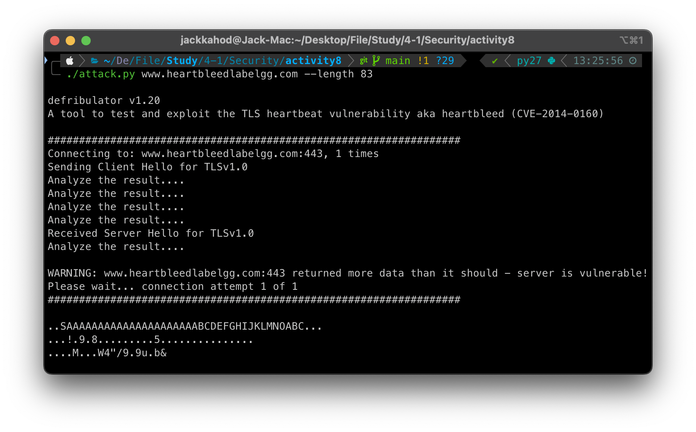

# Activity: Network Security Vulnerabilities

    Target (Thanat Wongsamut 6432067021)
    Attacker (Punyaphat Surakiatkamjorn 6432106821)

## Part I: Prepare your target VM

## Part II: DoS (Denial of Service)

`sudo sysctl -q net.ipv4.tcp_max_syn_backlog`

`netstat -a`

`netstat -na`

### Q1. What is the attacker's IP address?

**Ans**

Host IP 192.168.40.34

VM IP 192.168.40.186

\pagebreak

### Q2. What command did you use to run the attack?

**Ans**

`sudo netwox 76 -i 192.168.40.196 -p 80`

### Q3. How do you know the attack is successful? Hint: Use the browser on your notebook to access the webpage. What should happen if the attack is successful?

**Ans**

If the attack is **unsuccessful**, the webpage on the target server will still load normally without any noticeable delay.

Webpage

`netstat -a`

If the attack is **successful** (after set synccookies = 0), the webpage on the target server will not load or will time out, indicating that the server is unable to handle new connections.

set synccookies = 0

Webpage lost connection

`netstat -a`

### Q4. “netwox” performs the TCP SYN Flood attack using spoofed IP addresses. Give some examples of the spoofed IP addresses you see on the target machine.

**Ans**

Spoofed IP address: `209.238.44.226`, `212.48.107.82`, `17.67.63.138`

### Q5. In the TCP SYN Flood attack, what resource on the server side is exhausted? What is the number of resources available, and how many of those resources get used up in the attack?

**Ans**

- What resource on the server side is exhausted?

  **→** Connection queue. This queue holds connections that have received a SYN request but have not yet completed the three-way handshake.

- What is the number of resources available?

  **→** 512

- How many of those resources get used up in the attack?

  **→** The queue gets filled up with spoofed SYN requests, reaching this maximum limit and preventing legitimate connections from being established.

### Q6. How do TCP SYN cookies prevent this type of attack?

**Ans**

TCP SYN cookies help prevent SYN Flood attacks by changing how the server handles incoming SYN requests. Instead of storing the half-open connection in the queue, the server encodes essential information about the connection (like the initial sequence number and other details) into the TCP sequence number of the SYN-ACK response.

\pagebreak

## Part III: SSL Vulnerabilities

### Q7. For each piece of secret that you steal from the Heartbleed attack, you need to show the screenshots as the proof. Upload a pdf of your screenshots.

**Ans**

**The exact content of the private message.**

**User’s activity**

**Username and password**

\pagebreak

### Q8. For the Heartbleed attack, explain how you did the attack, and what your observations are.

**Ans**

I ran `./attack.py www.heartbleedlabelgg.com` multiple times. Sometimes, I was able to retrieve sensitive information from the server’s memory, such as usernames, passwords, and private messages.

### Q9. As the length variable decreases, what kind of difference can you observe?

**Ans**

The more length variable increases, the more I get extra data from the server

**Length 83**

**Length 1200**

\pagebreak

### Q10. As the length variable decreases, there is a boundary value for the input length variable. At or below that boundary , the Heartbeat query will receive a response packet without attaching any extra data (which means the request is benign). Please find that boundary length. You may need to try many different length values until the web server sends back the reply without extra data. To help you with this, when the number of returned bytes is smaller than the expected length, the program will print "Server processed malformed Heartbeat, but did not return any extra data. " What is the boundary length?

**Ans**

Boundary Length is 22

As you can see, when the length is 22, the program will print `Server processed malformed heartbeat, but did not return any extra data.` that means that the server didn't send any extra data. But when the length is 23, the program will print `WARNING: www.heartbleedlabelgg.com:443 returned more data than it should - server is vulnerable!`

### Q11: Try your attack again after you have updated the OpenSSL library. Are you successful at stealing data from the server after the upgrade?

**Ans**

No

### Q12. Please point out the problem from the code and provide a solution to fix the bug (i.e., what modification is needed to fix the bug). You do not need to recompile the code; just describe how you can fix the problem.

**Ans**

The problem with the code lies in the lack of validation for `payload_length`. The server trusts the length value provided in the packet, which can lead to buffer over-reads (like the Heartbleed vulnerability) if the length is incorrect or maliciously crafted. The code should check that payload_length does not exceed the actual size of the received data, rejecting any requests where the length is invalid. Additionally, setting a reasonable maximum limit for payload_length can prevent excessive memory allocation, ensuring that the server only processes valid and safe payload lengths.

\pagebreak

### Q13. Comment on the following discussions by Alice, Bob, and Eva regarding the fundamental cause of the Heartbleed vulnerability: Alice thinks the fundamental cause is missing the boundary checking during the buffer copy; Bob thinks the cause is missing the user input validation; Eva thinks that we can just delete the length value from the packet to solve everything. Who do you agree and disagree with, and why?

**Ans**

I agree with Alice and Bob, but not with Eva.

Alice is correct because the Heartbleed vulnerability arises from missing boundary checks during buffer copying, allowing extra data to be read.

Bob is also right, as validating user input could have prevented the use of malformed packets.

However, I disagree with Eva; simply removing the length value from the packet would not solve the problem, as the server still needs a way to determine how much data to respond with. Proper validation and boundary checking are the key solutions.
