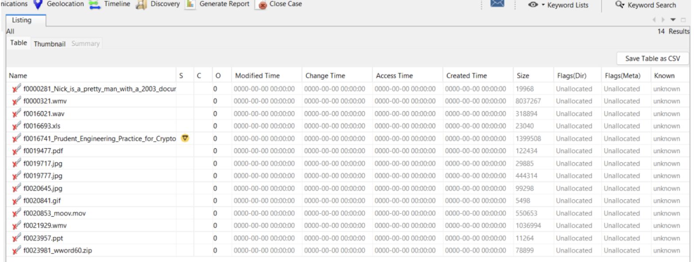

# Activity: Computer Forensics

## Part I. File Carving

### 1. Look at the data on the file system (Click on Data Sources and look at the hex values on the right). The file system has no files, but why are we able to find items on the disk image? Explain why the file system has no files but there are items that can be found on the disk image.

**<u>Ans</u>**

Based on the picture, all sections are marked as "unallocated," meaning the system can write to those areas. However, the contents of the deleted files are not actually erased. By using a tool or method, such as Autopsy, you can recover and list deleted files that are marked as "unallocated."

### 2. How many objects can you find?

**<u>Ans</u>** 14 files

\pagebreak

### 3. List all the objects here and report on whether or not the content is accessible or damaged/corrupted. Also note which files were actually already deleted.

**<u>Ans</u>**

According to the image, all files are marked as "unallocated," and no files are damaged, corrupted, or actually deleted.

### 4. Think securely: If we want to delete files on a magnetic hard disk and not have them be recovered by any tool, what do we need to do? And how much time do you think you need to wipe a 1TB magnetic hard disk?

**<u>Ans</u>**

To completely delete a file from an HDD, overwrite it at least once with random data. For higher security, use 3 passes (following the DoD standard). More passes (like 7) are generally overkill for modern drives.

To ensure files are fully deleted on a magnetic hard disk, I will use 3 passes for this calculation.

For a single-pass overwrite on a modern HDD with a write speed of 150 MB/s:

    1 TB = 1,000,000 MB
    Time = 1,000,000 MB / 150 MB/s ≈ 6,667 seconds ≈ 1.85 hours
    Thus, for 3 passes:

    Total time = 1.85 hours x 3 ≈ 5.55 hours

### 5. Will file carving be able to recover deleted files on an SSD? Why or why not?

**<u>Ans</u>**

When a file is deleted on an SSD, it may not be in its original location or may be replaced by new data, making it difficult for file carving techniques to recover it. Additionally, SSDs often use TRIM commands to inform the drive that sectors are no longer in use, which can result in immediate and permanent deletion of the file's data.

## Part II. Investigation

## 1. List all directories that were traversed in ‘RM#2’.

**<u>Ans</u>**

1. design
2. PRICIN~1
3. progress
4. proposal
5. TeCHNI~1

\pagebreak

## 2. List all files that were opened in 'RM#2’. 5 Computer Security Dept. of Computer Engineering Chulalongkorn University

**<u>Ans</u>**

\pagebreak

## 3. Recover deleted files from USB drive ‘RM#2’. What files were you able to recover?

**<u>Ans</u>**

\pagebreak

## 4. What actions were performed for anti-forensics on USB drive ‘RM#2’? [Hint: this can be inferred from the results of the above question]

**<u>Ans</u>**

For anti-forensics on USB drive ‘RM#2’, the action performed was changing the file extension to make it not match the MIME type. This makes it more challenging to identify and recover the file using file carving techniques, as the file’s extension no longer reflects its true content type.

- After restoring the file and trying to open it, the file cannot be read.

- From the metadata, we know that this file is of MS Word type.

\pagebreak

- Tried changing the file extension to match the MIME type.

\pagebreak

Examine media #3.

## 5. Recover hidden files from the CD-R ‘RM#3’. What files were you able to recover?

**<u>Ans</u>**

\pagebreak

## 6. What actions were performed for anti-forensics (data hiding) on CD-R ‘RM#3’?

**<u>Ans</u>**

Changed the file name to make it unrelated to the content of the file.

