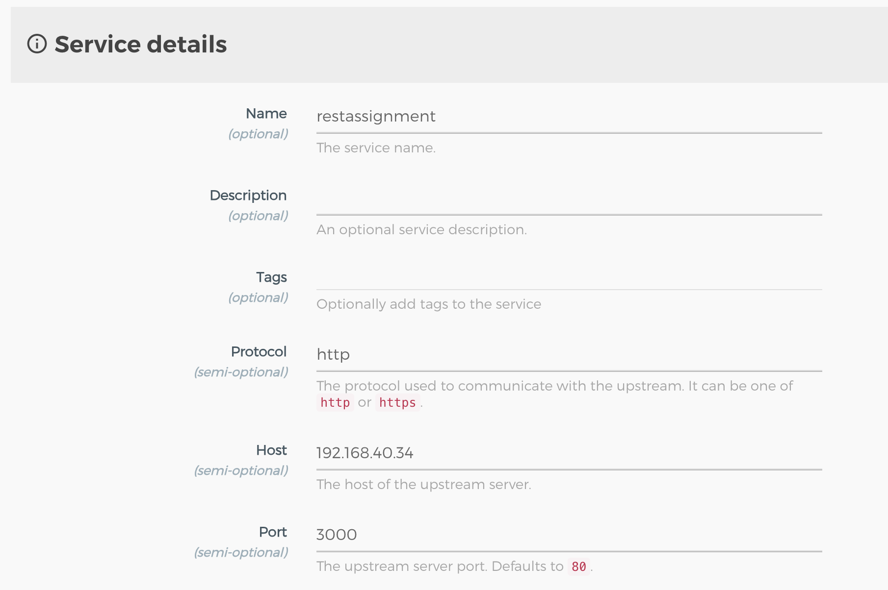
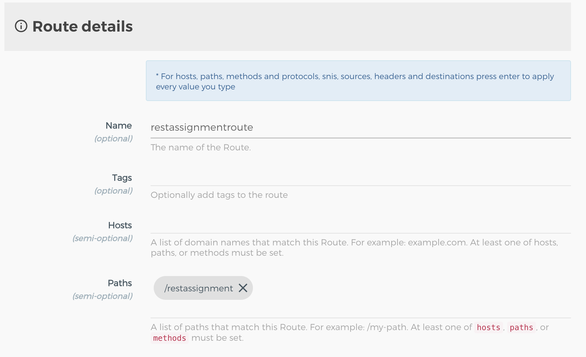
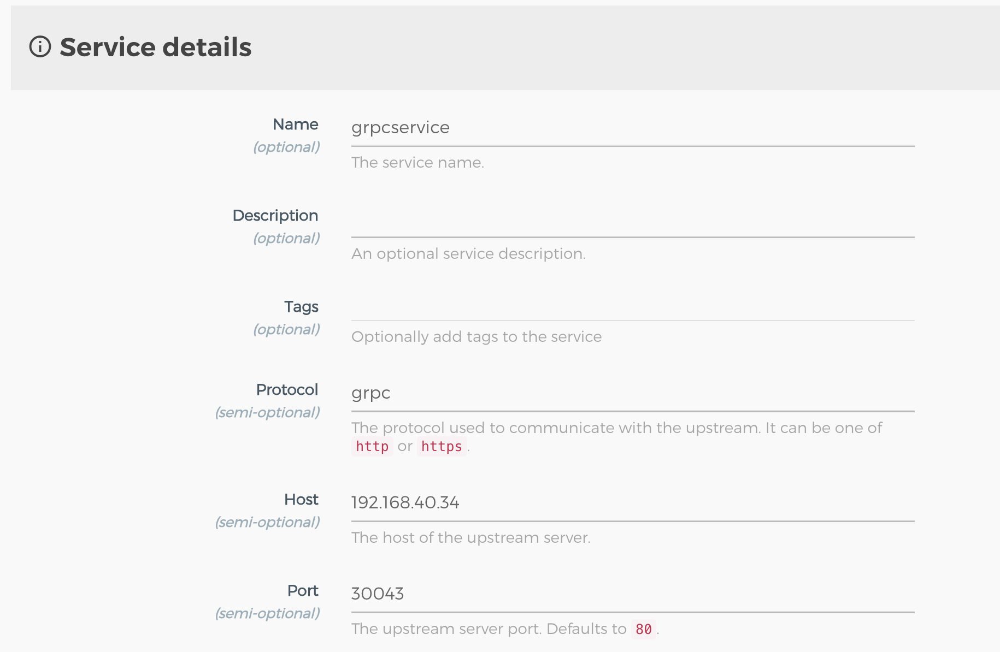
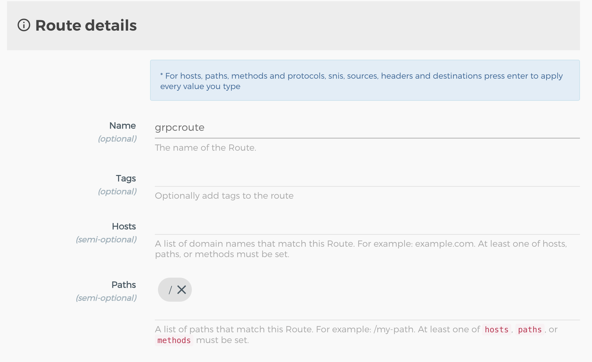
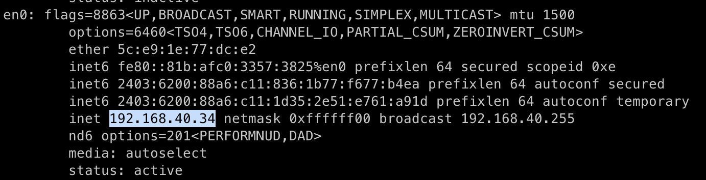

### REST API

| **Service**              | **Route**                | **Test**                                             |
| ------------------------ | ------------------------ | ---------------------------------------------------- |
|  |  |  |

### gRPC

| **Service**            | **Route**                | **Test**                                             |
| ---------------------- | ------------------------ | ---------------------------------------------------- |
|  |  |  |

`ifconfig`

